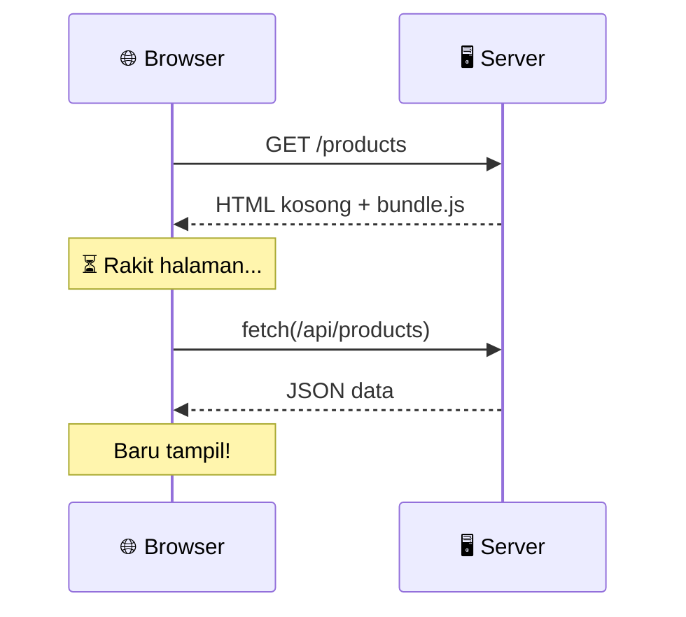
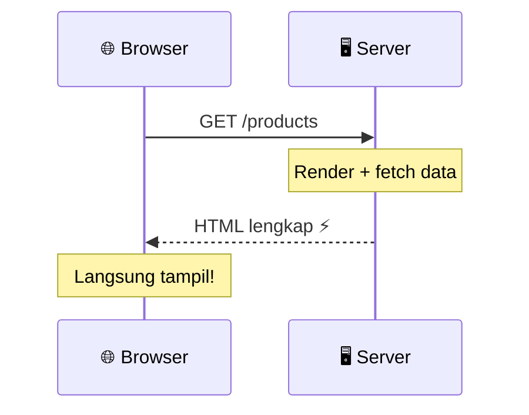
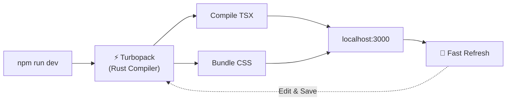

## 01. Pengenalan Next.js & Setup Project

Memahami Fondasi Next.js, Perbedaan Arsitektur dengan React Biasa, serta Setup Project dengan Tooling Modern.

<!--
Modul ini adalah fondasi. Pastikan peserta memahami KENAPA Next.js, bukan hanya BAGAIMANA setup-nya.
Tekankan bahwa Next.js bukan sekadar "React + Router" tapi framework fullstack.
Durasi target: 45-60 menit.
-->

---

### Kenapa Next.js?

Standar Industri Modern untuk Membangun Aplikasi Web React yang Cepat, Aman, dan Skalabel.
Next.js bukan sekadar React dengan router bawaan. **Next.js adalah framework fullstack** yang memperluas kemampuan React ke server, menghadirkan performa tinggi dan developer experience kelas atas.

<div class="grid grid-cols-3 gap-4 mt-6">
  <BrutalCard v-click="1" class="forward:delay-0">
    <div class="font-black text-base mb-1">🌐 Fullstack & Server-First</div>
    <p class="text-xs text-gray-700">Ambil data langsung dari database di dalam komponen (RSC) tanpa repot membuat REST API terpisah dan <strong>0 KB beban JavaScript ke browser</strong>.</p>
  </BrutalCard>
  <BrutalCard v-click="2" class="forward:delay-200">
    <div class="font-black text-base mb-1">⚡ Hybrid Rendering & Streaming</div>
    <p class="text-xs text-gray-700">Gabungkan kecepatan HTML statis (CDN), SSR dinamis, dan <strong>Streaming Suspense</strong>. Konten tampil instan tanpa membuat user menunggu.</p>
  </BrutalCard>
  <BrutalCard v-click="3" class="forward:delay-400">
    <div class="font-black text-base mb-1">🛡️ Standar Industri & Aman</div>
    <p class="text-xs text-gray-700">Kunci API & kredensial database aman di server. Dioptimalkan otomatis untuk Core Web Vitals, SEO, dan dipakai perusahaan raksasa dunia.</p>
  </BrutalCard>
</div>

<!--
Klik 3x untuk memunculkan card satu per satu.
Card 1: Tekankan bahwa RSC = 0 KB JS, data fetching di server.
Card 2: Jelaskan Streaming Suspense secara singkat — user tidak perlu menunggu seluruh halaman selesai.
Card 3: Sebutkan contoh perusahaan: Vercel, Netflix, TikTok, Twitch.
-->

---
layout: two-cols
---

### React Biasa (SPA) vs Next.js

Memahami Perbedaan Cara Menampilkan Halaman ke Pengunjung

::left::

#### React Biasa (Vite / CRA)

- 📦 **Browser Bekerja Sendirian**: Browser mengunduh file HTML kosong `<div id="root"></div>`, lalu sibuk merakit halaman sendiri.
- ⏳ **Layar Putih Sejenak**: Pengunjung sering melihat halaman kosong atau loading spinner sebelum isi konten muncul.
- 🔍 **Kurang Ramah SEO**: Mesin pencari dan media sosial kesulitan membaca isi teks jika halaman lambat dirakit.
- 🛡 **Kode Rahasia Rawan Bocor**: Kunci API privat atau logika rahasia tidak aman jika ditaruh di komponen biasa (Client Component).

::right::

#### Next.js (App Router)

- ⚡ **Tampilan Siap Baca**: Server langsung merakit dan mengirimkan halaman siap jadi, sehingga tulisan langsung tampil seketika.
- 🧩 **Ukuran File Lebih Ringan**: Sebagian besar pekerjaan selesai di server, sehingga perangkat pengunjung tidak terbebani kode berlebih.
- 📈 **Mudah Dibagikan ke Medsos**: Judul, gambar thumbnail, dan deskripsi otomatis terbaca rapi saat link dibagikan.
- 🔒 **Jauh Lebih Aman**: Sambungan ke database dan password rahasia tersimpan aman di server tanpa bisa diintip pengunjung.

<!--
Gunakan analogi: SPA seperti "memesan furnitur IKEA — datang dalam potongan, dirakit sendiri".
Next.js seperti "memesan furnitur jadi — langsung pakai begitu sampai".
-->

---
layout: two-cols
---

### Visualisasi Alur Request

Melihat Perbedaan Perjalanan Data dari Browser ke Server

::left::

#### React Biasa (SPA)



::right::

#### Next.js (App Router)



<!--
Tekankan perbedaan jumlah round-trip: SPA = 3 kali bolak-balik, Next.js = 1 kali.
Ini dampaknya besar di koneksi lambat (3G, pedesaan).
Tanyakan ke peserta: "Kira-kira mana yang lebih cepat di HP dengan sinyal lemah?"
-->

---

### Ringkasan Perbedaan Utama

Tabel Komparasi Sederhana untuk Memilih Pendekatan yang Pas

| Aspek                           | React Biasa (Vite / CRA)                        | Next.js (App Router)                                                                      |
| :------------------------------ | :---------------------------------------------- | :---------------------------------------------------------------------------------------- |
| **Cara Tampil**                 | Browser merakit halaman sendiri dari nol        | Server mengirim halaman yang sudah jadi                                                   |
| **Kecepatan Buka Awal**         | Muncul layar kosong atau spinner sesaat         | <span v-mark.highlight.yellow="1">Konten langsung terbaca dalam hitungan milidetik</span> |
| **Beban di Perangkat Pengguna** | Makin banyak halaman, file JS makin besar       | Ringan, hanya mengirim kode yang dipakai                                                  |
| **Pembuatan Halaman (Routing)** | Harus install library tambahan (`react-router`) | <span v-mark.highlight.yellow="2">Cukup buat folder baru di dalam `app/`</span>           |
| **Optimasi Gambar**             | Harus compress gambar manual satu per satu      | Otomatis dioptimalkan lewat `next/image`                                                  |
| **SEO & Social Share**          | Butuh pengaturan rumit tambahan                 | <span v-mark.highlight.yellow="3">Bawaan otomatis lewat fitur Metadata</span>             |

<!--
Klik 3x untuk highlight keunggulan utama Next.js satu per satu.
Tanyakan ke peserta: "Siapa yang pernah pusing setting react-router?"
Highlight kuning muncul dengan gaya hand-drawn (rough notation).
-->

<style>
table th, table td {
  padding: 1rem 0.5rem;
  font-size: 0.85rem;
}
</style>

---

### Inisialisasi Project Baru

Langkah Praktis Memulai Project Next.js Menggunakan `create-next-app`

Jalankan perintah ini di terminal Antum:

```bash
npx create-next-app@latest my-next-app
```

<div class="mt-4"></div>

````md magic-move
```bash
✔ What is your project named? … my-next-app
```

```bash
✔ What is your project named? … my-next-app
✔ Would you like to use TypeScript? … Yes
```

```bash
✔ What is your project named? … my-next-app
✔ Would you like to use TypeScript? … Yes
✔ Would you like to use ESLint? … Yes
✔ Would you like to use Tailwind CSS? … Yes
```

```bash
✔ What is your project named? … my-next-app
✔ Would you like to use TypeScript? … Yes
✔ Would you like to use ESLint? … Yes
✔ Would you like to use Tailwind CSS? … Yes
✔ Would you like your code inside a `src/` directory? … Yes
✔ Would you like to use App Router? (recommended) … Yes
✔ Would you like to customize the import alias? … No
```
````

<BrutalCard v-click class="mt-4">
  ✅ Rekomendasi di kelas ini: Tekan Enter untuk memilih opsi default (pilih <strong>Yes</strong>, dan <strong>No</strong> untuk customize alias).
</BrutalCard>

<!--
Demo langsung di terminal jika memungkinkan.
Proses install biasanya 30-60 detik tergantung koneksi.
Jelaskan: src/ directory memisahkan kode sumber dari config files di root.
-->

---
layout: two-cols
leftCard: false
rightCard: false
---

### Anatomi Project Next.js

Mengenal Isi Folder yang Dihasilkan `create-next-app`

::left::

```txt {3-6|7|8-12|all}
my-next-app/
├── src/
│   └── app/
│       ├── layout.tsx
│       ├── page.tsx
│       └── globals.css
├── public/
├── next.config.ts
├── tailwind.config.ts
├── tsconfig.json
├── eslint.config.mjs
└── package.json
```

::right::

<div class="space-y-3">

<BrutalCard>
  <div class="font-black">📁 src/app/ — Jantung Aplikasi</div>
  <p class="text-gray-700 mt-1"><strong>layout.tsx</strong> = pembungkus semua halaman<br/><strong>page.tsx</strong> = halaman beranda (<code>/</code>)<br/><strong>globals.css</strong> = stylesheet global Tailwind</p>
</BrutalCard>

<BrutalCard v-click="1">
  <div class="font-black">📁 public/ — Aset Statis</div>
  <p class="text-gray-700 mt-1">Gambar, favicon, dan file statis lainnya yang bisa diakses langsung via URL tanpa proses build.</p>
</BrutalCard>

<BrutalCard v-click="2">
  <div class="font-black">⚙️ File Konfigurasi</div>
  <p class="text-gray-700 mt-1"><strong>next.config.ts</strong> = atur framework<br/><strong>tailwind.config.ts</strong> = atur styling<br/><strong>tsconfig.json</strong> = atur TypeScript</p>
</BrutalCard>

</div>

<!--
Klik 3x untuk menjelaskan tiap kelompok folder + highlight pada tree di kiri.
Klik 1: Fokus ke app/ — ini jantung aplikasi, tempat semua halaman dibuat. layout.tsx = "bingkai" yang membungkus semua halaman.
Klik 2: public/ — bedakan dengan assets yang di-import (processed oleh bundler vs langsung serve).
Klik 3: Config files — jelaskan bahwa kebanyakan sudah auto-generated, jarang perlu diubah manual.

Slide ini menjadi jembatan natural ke Modul 02 (App Router & Routing).
-->

---

### Tailwind CSS: Styling Cepat

Menulis CSS Langsung di Atribut `className` Tanpa Berpindah File

````md magic-move
```tsx
// ❌ Legacy Approach: Create separate CSS file & think of class names
import "./button.css";

export default function Button() {
  return <button className="primary-blue-button">Register Now</button>;
}
```

```tsx
// ✅ Tailwind CSS: Utility classes directly on elements!
export default function Button() {
  return (
    <button className="bg-blue-600 hover:bg-blue-700 text-white font-bold py-2 px-4 rounded-lg shadow-md transition-all">
      Register Now
    </button>
  );
}
```
````

<div v-click class="mt-4 grid grid-cols-3 gap-3 text-xs">
  <BrutalCard class="text-center forward:delay-0">
    <code>bg-blue-600</code><br/>Warna latar tombol
  </BrutalCard>
  <BrutalCard class="text-center forward:delay-200">
    <code>hover:bg-blue-700</code><br/>Efek saat kursor diarahkan
  </BrutalCard>
  <BrutalCard class="text-center forward:delay-400">
    <code>py-2 px-4</code><br/>Jarak padding vertikal & horizontal
  </BrutalCard>
</div>

<!--
Magic move menganimasikan transisi dari pendekatan CSS terpisah ke Tailwind CSS.
Tunjukkan bahwa:
1. Tidak perlu file CSS terpisah (import "./button.css" hilang)
2. Tidak perlu memikirkan nama class kustom (.primary-blue-button)
3. Utility classes langsung deskriptif (bg-blue-600, hover:bg-blue-700, py-2 px-4)
-->

---
layout: two-cols
---

### Konfigurasi Linter & Formatter

Menjaga Kode Tetap Bersih, Rapi, dan Konsisten di Dalam Tim

::left::

#### ESLint (Flat Config & CLI)

Mendeteksi **kesalahan logika dan bug** sebelum dijalankan:

```js {1-2|3-4|6-8|10|all}
// eslint.config.mjs
import { dirname } from "path";
import { fileURLToPath } from "url";
import { FlatCompat } from "@eslint/eslintrc";

const compat = new FlatCompat({
  baseDirectory: dirname(fileURLToPath(import.meta.url)),
});

export default [...compat.extends("next/core-web-vitals")];
```

Jalankan audit kode via CLI ESLint:

```bash
npx eslint .
```

::right::

#### Prettier (Auto-Formatting)

Merapikan **spasi, titik koma, dan urutan class**:

```bash
npm install -D prettier prettier-plugin-tailwindcss
```

Buat file `.prettierrc`:

```json {3|4|all}
{
  "semi": false,
  "singleQuote": true,
  "plugins": ["prettier-plugin-tailwindcss"]
}
```

<!--
ESLint — klik 5x untuk jelaskan bertahap:
1. Nama file — format flat config (.mjs), bukan .json lama
2. Import helper Node.js path — perlu karena ESM
3. FlatCompat — jembatan agar config lama (extends) tetap bisa dipakai
4. Extends next/core-web-vitals — aturan bawaan dari tim Next.js
5. Semua terlihat

Prettier: semi false = tanpa titik koma, singleQuote = petik satu.
Plugin tailwindcss = auto-sort class Tailwind saat format.
-->

---

### Ekosistem Linter: ESLint vs Oxlint vs Biome

Kecepatan Kompilasi Rust vs Kekuatan Plugin Spesifik Framework

<div class="grid grid-cols-3 gap-3 mt-2 text-xs">
  <!-- ESLint Card -->
  <BrutalCard v-click="1" class="flex flex-col justify-between forward:delay-0">
    <div>
      <div class="flex items-center justify-between mb-1.5">
        <span class="font-black text-sm text-brutal-black">ESLint</span>
        <span class="bg-brutal-yellow text-xs font-black px-1.5 py-0.5 border border-brutal-black rounded">Standar Industri</span>
      </div>
      <div class="text-xs text-gray-600 mb-2 font-mono">Engine: Node.js (JS/TS)</div>
      <ul class="space-y-1 text-xs text-gray-800 leading-snug">
        <li>⚡ <strong>Kecepatan:</strong> Baseline (~1x, terasa lambat di monorepo raksasa).</li>
        <li>🔌 <strong>Ekosistem:</strong> <strong>Tak tertandingi</strong>. Ribuan plugin komunitas matang.</li>
        <li>🎯 <strong>Cocok untuk:</strong> Proyek Next.js nyata yang butuh aturan framework khusus.</li>
      </ul>
    </div>
    <div class="mt-2 pt-2 border-t border-dashed border-gray-300 font-bold text-xs text-green-700">
      ✅ Bawaan resmi <code>create-next-app</code>
    </div>
  </BrutalCard>

  <!-- Oxlint Card -->
  <BrutalCard v-click="2" class="flex flex-col justify-between forward:delay-200">
    <div>
      <div class="flex items-center justify-between mb-1.5">
        <span class="font-black text-sm text-brutal-black">Oxlint (Oxc)</span>
        <span
          v-motion
          :initial="{ scale: 0.8, x: -10 }"
          :enter="{ scale: 1, x: 0, transition: { type: 'spring', stiffness: 300 } }"
          class="bg-brutal-cyan text-xs font-black px-1.5 py-0.5 border border-brutal-black rounded"
        >⚡ 50x–100x Rust</span>
      </div>
      <div class="text-xs text-gray-600 mb-2 font-mono">Engine: Rust</div>
      <ul class="space-y-1 text-xs text-gray-800 leading-snug">
        <li>⚡ <strong>Kecepatan:</strong> <strong>50x – 100x</strong> lebih cepat dari ESLint.</li>
        <li>🔌 <strong>Ekosistem:</strong> Fokus aturan inti (correctness); dikombinasikan dengan <code>fmtlint</code> untuk format.</li>
        <li>🎯 <strong>Cocok untuk:</strong> Pre-commit git hook kilat & filter cepat di pipeline CI.</li>
      </ul>
    </div>
    <div class="mt-2 pt-2 border-t border-dashed border-gray-300 font-bold text-xs text-cyan-800">
      🤝 Sinergi via <code>eslint-plugin-oxlint</code> & <code>fmtlint</code>
    </div>
  </BrutalCard>

  <!-- Biome Card -->
  <BrutalCard v-click="3" class="flex flex-col justify-between forward:delay-400">
    <div>
      <div class="flex items-center justify-between mb-1.5">
        <span class="font-black text-sm text-brutal-black">Biome (ex-Rome)</span>
        <span
          v-motion
          :initial="{ scale: 0.8, x: -10 }"
          :enter="{ scale: 1, x: 0, transition: { type: 'spring', stiffness: 300, delay: 150 } }"
          class="bg-brutal-pink text-brutal-white text-xs font-black px-1.5 py-0.5 border border-brutal-black rounded"
        >⚡ 25x–35x Rust</span>
      </div>
      <div class="text-xs text-gray-600 mb-2 font-mono">Engine: Rust</div>
      <ul class="space-y-1 text-xs text-gray-800 leading-snug">
        <li>⚡ <strong>Kecepatan:</strong> <strong>25x – 35x</strong> lebih cepat (Linter + Formatter Prettier).</li>
        <li>🔌 <strong>Ekosistem:</strong> Tertutup/mandiri. <strong>Tidak mendukung</strong> instalasi plugin ESLint eksternal.</li>
        <li>🎯 <strong>Cocok untuk:</strong> Proyek mandiri yang ingin zero-config dan super ringkas.</li>
      </ul>
    </div>
    <div class="mt-2 pt-2 border-t border-dashed border-gray-300 font-bold text-xs text-red-700">
      ⚠️ Belum mendukung plugin AST pihak ketiga
    </div>
  </BrutalCard>
</div>

<!--
Klik 3x untuk reveal card satu per satu dengan efek stagger.
Intinya: untuk kelas ini kita pakai ESLint karena punya plugin Next.js resmi.
Oxlint & Biome = informasi tambahan agar peserta tahu landscape.
Jangan terlalu lama di slide ini — cukup 2-3 menit.
Slide ini boleh di-skip jika waktu terbatas.
-->

---
layout: two-cols
---

### Auto Sort & Remove Unused Imports

Otomatisasi Kebersihan Import di Header File Tanpa Dikerjakan Manual

::left::

#### 🔌 Ekosistem ESLint (Next.js Paling Populer)

Kombinasi plugin standar industri:

- **`eslint-plugin-simple-import-sort`**: Mengurutkan import secara deterministik dan teratur.
- **`eslint-plugin-unused-imports`**: Otomatis menghapus import & variabel tak terpakai saat `--fix`.

```bash
npm i -D eslint-plugin-simple-import-sort eslint-plugin-unused-imports
```

<BrutalCard class="mt-2 bg-yellow-50 text-xs">
  🎯 <strong>Keunggulan:</strong> Aturan pengelompokan regex sangat fleksibel (React/Next duluan, lalu package npm, alias <code>@/</code>, relative <code>./</code>, dan CSS).
</BrutalCard>

::right::

#### ⚡ Bawaan Biome vs Oxlint

Bagaimana Linter Generasi Rust Menanganinya?

<div class="space-y-2 mt-1 text-xs">
  <BrutalCard v-click="1" class="forward:delay-0">
    <div class="font-bold flex items-center justify-between text-brutal-pink">
      <span>Biome (Built-in)</span>
      <span class="text-xs bg-green-100 text-green-800 px-1 rounded border border-brutal-black font-mono font-bold">All-in-One</span>
    </div>
    <p class="text-xs text-gray-700 mt-1">
      Punya fitur bawaan <code>organizeImports</code>. Sort & remove unused imports berjalan <strong>otomatis 25x–35x lebih cepat</strong> tanpa install plugin tambahan via <code>biome check --write</code>.
    </p>
  </BrutalCard>

  <BrutalCard v-click="2" class="forward:delay-200">
    <div class="font-bold flex items-center justify-between text-brutal-cyan">
      <span>Oxlint (Linter Only)</span>
      <span class="text-xs bg-yellow-100 text-yellow-800 px-1 rounded border border-brutal-black font-mono font-bold">Fast Audit</span>
    </div>
    <p class="text-xs text-gray-700 mt-1">
      Sangat cepat mendeteksi error <code>no-unused-vars</code> (50x–100x), namun fokus pada <strong>audit diagnosa</strong>; umum dikombinasikan dengan <code>fmtlint</code> untuk eksekusi formatting & auto-sort.
    </p>
  </BrutalCard>
</div>

<!--
Slide ini cukup di-skip cepat jika waktu terbatas.
Intinya: ESLint plugin untuk sort/remove ada, Biome sudah built-in, Oxlint fokus linting murni (dikombinasikan dengan fmtlint untuk formatting).
-->

---

### Demo: Auto Sort & Remove Unused Imports

Satu Kali Simpan (Ctrl+S / Cmd+S), Seluruh Header File Langsung Bersih!

````md magic-move
```tsx
// ❌ 1. Before: Messy order & unused imports
import "./button.css";
import { useState, useEffect } from "react";
import Image from "next/image";
import { formatCurrency } from "@/utils/format";
import Link from "next/link";
import { Trash, Heart } from "lucide-react";
import { UserCard } from "./UserCard";
import axios from "axios";

export default function ProductCard({ title }: { title: string }) {
  const [liked, setLiked] = useState(false);

  return (
    <div>
      <h3>{title}</h3>
      <Link href="/cart">Buy Now</Link>
      <button onClick={() => setLiked(!liked)}>
        <Heart className={liked ? "text-red-500" : ""} />
      </button>
    </div>
  );
}
```

```tsx
// 🧹 2. Auto Remove: Unused imports purged automatically!
// (useEffect, Image, formatCurrency, Trash, UserCard, axios are removed)
import "./button.css";
import { useState } from "react";
import Link from "next/link";
import { Heart } from "lucide-react";

export default function ProductCard({ title }: { title: string }) {
  const [liked, setLiked] = useState(false);

  return (
    <div>
      <h3>{title}</h3>
      <Link href="/cart">Buy Now</Link>
      <button onClick={() => setLiked(!liked)}>
        <Heart className={liked ? "text-red-500" : ""} />
      </button>
    </div>
  );
}
```

```tsx
// ✨ 3. Auto Sort: Cleanly grouped and sorted!
// 1. Core Framework (React & Next.js)
import Link from "next/link";
import { useState } from "react";

// 2. Third-Party Dependencies (lucide-react)
import { Heart } from "lucide-react";

// 3. Side-Effects / Stylesheets
import "./button.css";

export default function ProductCard({ title }: { title: string }) {
  const [liked, setLiked] = useState(false);

  return (
    <div>
      <h3>{title}</h3>
      <Link href="/cart">Buy Now</Link>
      <button onClick={() => setLiked(!liked)}>
        <Heart className={liked ? "text-red-500" : ""} />
      </button>
    </div>
  );
}
```
````

<BrutalCard v-click class="mt-2 text-xs flex items-center justify-between">
  <span>💡 <strong>Tips Produktivitas:</strong> Aktifkan <code>"editor.codeActionsOnSave": { "source.fixAll.eslint": "explicit" }</code> di VS Code Antum!</span>
  <span class="bg-brutal-yellow px-2 py-0.5 border border-brutal-black rounded text-xs font-black">Zero Mental Overhead</span>
</BrutalCard>

<!--
Magic move akan menganimasikan transisi dari kode berantakan → bersih → tersortir.
Step 1→2: Fokuskan perhatian ke import yang menghilang (useEffect, Image, dll) — 6 import dihapus!
Step 2→3: Fokuskan ke urutan yang berubah (React/Next dulu, lalu third-party, lalu CSS)
Tunjukkan bahwa ini terjadi OTOMATIS saat Ctrl+S di VS Code.
-->

---

### Menjalankan Development Server (Turbopack)

Melihat Hasil Proyek Pertama Antum Secara Langsung dengan Kompiler Rust

Jalankan perintah ini di terminal proyek:

```bash
npm run dev
```

<v-clicks>

1. 🌐 Buka browser dan kunjungi alamat `http://localhost:3000`
2. 🎉 Halaman pembuka Next.js siap menyambut Antum!
3. ⚡ Di **Next.js 16**, engine **Turbopack sudah aktif secara default** — kompilasi dan _Fast Refresh_ berjalan secepat kilat!

</v-clicks>



<BrutalCard v-click class="mt-2">
  <BrutalBadge color="cyan">TIGA SCRIPT UTAMA (TURBOPACK DEFAULT)</BrutalBadge>
  <div class="grid grid-cols-3 gap-2 mt-3 text-xs">
    <div><code>npm run dev</code> — Jalankan mode koding (development)</div>
    <div><code>npm run build</code> — Kompilasi untuk siap rilis (production)</div>
    <div><code>npm run start</code> — Uji jalankan hasil kompilasi produksi</div>
  </div>
</BrutalCard>

<!--
Jika memungkinkan, demo langsung di terminal.
Tunjukkan bahwa setelah edit file dan save, halaman di browser langsung berubah (Fast Refresh) tanpa reload manual.
Jelaskan diagram: Turbopack menggantikan Webpack — jauh lebih cepat karena ditulis dalam Rust.
Siklus Fast Refresh: edit → save → Turbopack compile ulang hanya file yang berubah → browser update otomatis.
-->

---
layout: intro
badge: "RANGKUMAN"
badgeColor: "yellow"
hideInToc: true
transition: slide-up
---

## 3 Hal Penting dari Modul 01

<v-clicks>

1. <span v-mark.box.yellow="1">**Next.js Menggabungkan Server & Browser**</span>: Menghadirkan performa cepat, ramah mesin pencari (SEO), dan hemat beban perangkat pengguna.
2. <span v-mark.box.cyan="2">**Setup Cepat & Turbopack Default**</span>: `create-next-app` langsung menghasilkan project modern dengan engine Turbopack Rust bawaan Next.js 16.
3. <span v-mark.box.pink="3">**Tooling Modern Meningkatkan Kecepatan Kerja**</span>: Kombinasi Prettier, ESLint Flat Config, dan Tailwind CSS memastikan kode Antum selalu rapi dan konsisten.

</v-clicks>

<BrutalCard v-click class="mt-8 bg-brutal-cyan/10">
  🚀 <strong>Selanjutnya di Modul 02:</strong> Kita akan mempelajari bagaimana <strong>App Router</strong> mengubah folder menjadi halaman secara otomatis — cukup buat folder baru di <code>app/</code>, dan rute langsung tersedia!
</BrutalCard>

<!--
Rangkuman ini deliver dalam 1 menit.
v-mark box muncul bersamaan dengan teks (efek hand-drawn annotation).
Teaser Modul 02 membangun antisipasi untuk sesi berikutnya.
-->
