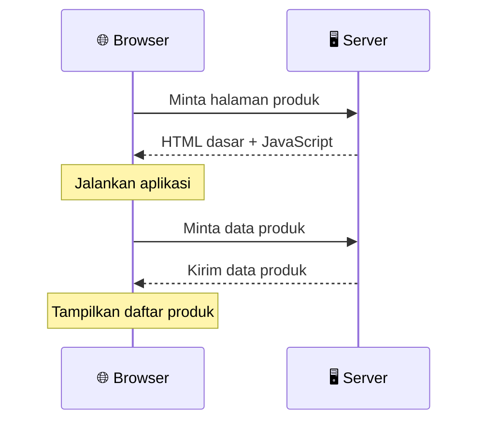
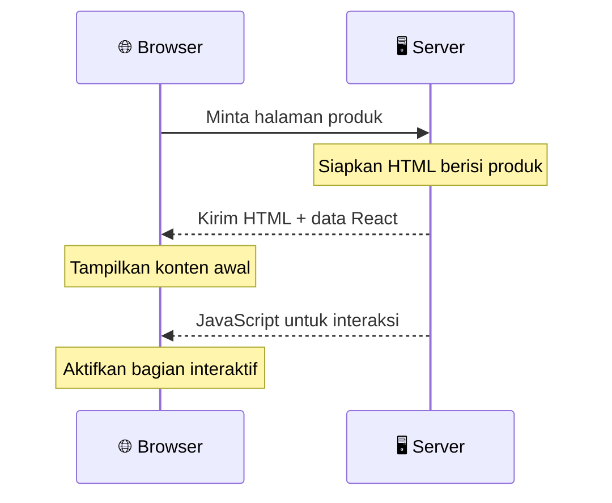
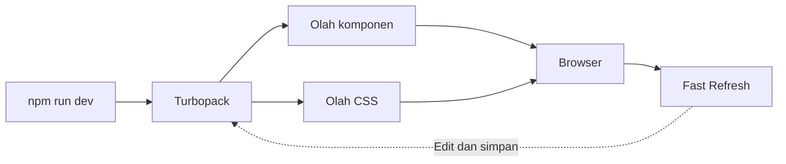

## 01. Pengenalan Next.js & Setup Project

Dari komponen React ke aplikasi Next.js: jalankan proyek pertama, ubah halaman beranda, lalu periksa hasilnya.

<!--
Audiens: pemula di Next.js yang sudah mengenal HTML, CSS, JavaScript, komponen React, props, dan dasar TypeScript.
Jika bekal tersebut belum ada, arahkan ke latihan fondasi pada slide tangga belajar.
Target akhir: peserta dapat menjelaskan hubungan React dan Next.js, menjalankan proyek, mengubah src/app/page.tsx, dan membedakan dev, build, serta start.
Durasi target 45–60 menit: pengenalan 10 menit, setup dan praktik 25–35 menit, pemeriksaan dan diskusi 10–15 menit.
Contoh berlanjut sebagai toko sederhana. Belum perlu database, autentikasi, atau keranjang yang berfungsi.
Detail routing ada di Modul 02–03; Server dan Client Components di Modul 04.
Audit sumber: 4 Oktober 2026. Versi di modul adalah acuan kelas pada tanggal tersebut, bukan janji selalu menjadi versi terbaru.
-->

---
class: module-content
---

### Kenapa Next.js?

Bayangkan Antum ingin membuat toko online: ada daftar produk, halaman detail, dan keranjang.
**React menyusun tampilannya. Next.js membantu menyatukan halaman, data, dan cara aplikasi dijalankan.**

<div class="grid grid-cols-3 auto-rows-fr gap-4 mt-4">
  <BrutalCard v-click="1" class="flex flex-col forward:delay-0">
    <div class="font-black text-base mb-1">🧭 Mengatur Halaman</div>
    <p class="text-xs text-gray-700">Susun halaman daftar produk, detail, dan keranjang melalui folder dan file halaman.</p>
    <div class="mt-auto pt-1 text-xs font-bold text-gray-700">App Router</div>
  </BrutalCard>
  <BrutalCard v-click="2" class="flex flex-col forward:delay-200">
    <div class="font-black text-base mb-1">🔗 Berpindah Halaman</div>
    <p class="text-xs text-gray-700">Buka halaman lain di aplikasi tanpa memuat ulang seluruh dokumen.</p>
    <div class="mt-auto pt-1 text-xs font-bold text-gray-700">next/link</div>
  </BrutalCard>
  <BrutalCard v-click="3" class="flex flex-col forward:delay-400">
    <div class="font-black text-base mb-1">🛍️ Membaca Data Produk</div>
    <p class="text-xs text-gray-700">Ambil nama, harga, dan stok di server sebelum menampilkannya kepada pengunjung.</p>
    <div class="mt-auto pt-1 text-xs font-bold text-gray-700">Server Components</div>
  </BrutalCard>
  <BrutalCard v-click="4" class="flex flex-col forward:delay-0">
    <div class="font-black text-base mb-1">🖼️ Menampilkan Gambar</div>
    <p class="text-xs text-gray-700">Sajikan foto sesuai ukuran layar dan tunda pemuatan gambar yang belum diperlukan.</p>
    <div class="mt-auto pt-1 text-xs font-bold text-gray-700">next/image</div>
  </BrutalCard>
  <BrutalCard v-click="5" class="flex flex-col forward:delay-200">
    <div class="font-black text-base mb-1">🏷️ Memberi Identitas Halaman</div>
    <p class="text-xs text-gray-700">Atur judul, deskripsi, dan gambar pratinjau saat halaman produk dibagikan.</p>
    <div class="mt-auto pt-1 text-xs font-bold text-gray-700">Metadata API</div>
  </BrutalCard>
  <BrutalCard v-click="6" class="flex flex-col forward:delay-400">
    <div class="font-black text-base mb-1">⏳ Menjelaskan Status</div>
    <p class="text-xs text-gray-700">Sediakan tampilan saat data dimuat dan pesan ketika terjadi kesalahan.</p>
    <div class="mt-auto pt-1 text-xs font-bold text-gray-700">loading.tsx · error.tsx</div>
  </BrutalCard>
</div>

<!--
Mulai dengan bertanya: halaman apa saja yang diperlukan sebuah toko online?
Klik 6x untuk menghubungkan kebutuhan tersebut dengan setiap card. Nama fitur cukup dikenalkan, bukan dihafalkan.
Framework adalah kerangka kerja dengan aturan dan alat bantu; isi halaman, loading, dan error tetap dibuat pengembang.
Server Components adalah fitur React yang didukung App Router. Next.js bukan satu-satunya pilihan framework React.
Sumber: https://nextjs.org/docs/app/getting-started/project-structure
Sumber: https://nextjs.org/docs/app/getting-started/server-and-client-components
Sumber: https://nextjs.org/docs/app/api-reference/components/link
Sumber: https://nextjs.org/docs/app/api-reference/components/image
Sumber: https://nextjs.org/docs/app/getting-started/metadata-and-og-images
-->

---
class: module-content
layout: two-cols
---

### React dan Next.js: Apa Hubungannya?

Keduanya memakai komponen React; yang berbeda adalah alat dan aturan di sekelilingnya.

::left::

#### React + Vite untuk SPA

- **React**: menyusun tampilan dari komponen.
- **Vite**: membantu menjalankan dan membangun proyek.
- **SPA** (Single-Page Application): navigasi dalam satu dokumen. Pada contoh ini, tampilan dirakit di browser.
- Router dan layanan data dipilih sesuai kebutuhan.

::right::

#### React di dalam Next.js

- Tetap menulis komponen dengan JSX/TSX.
- **App Router**: mengatur rute lewat folder dan file.
- Server dapat menyiapkan HTML; browser menangani interaksi.
- Dapat menyediakan endpoint server atau memakai backend lain.

<!--
SPA = Single-Page Application. UI = antarmuka pengguna. TSX = JSX di file TypeScript.
Perbandingan ini khusus SPA yang dirender di browser, bukan seluruh kemampuan React atau Vite. Vite juga mendukung penggunaan SSR.
Next.js tetap mendukung navigasi tanpa reload dokumen; SPA dan Next.js bukan kategori yang saling meniadakan.
Tidak ada jaminan Next.js selalu lebih cepat atau otomatis menghasilkan SEO yang baik. Pilihan bergantung kebutuhan produk dan implementasi.
CRA sudah deprecated untuk aplikasi baru sejak Februari 2025; tidak perlu menambah sejarah tooling ke materi inti.
Sumber: https://react.dev/learn/creating-a-react-app
Sumber: https://react.dev/blog/2025/02/14/sunsetting-create-react-app
-->

---
class: module-content
layout: two-cols
---

### Saat Halaman Pertama Kali Dibuka

Rendering berarti mengolah komponen dan data menjadi tampilan halaman.

::left::

#### Contoh SPA di Browser



::right::

#### Contoh Next.js App Router



<!--
Diagram adalah model sederhana pembukaan pertama, bukan urutan setiap request jaringan.
Pada contoh SPA, data diminta setelah aplikasi berjalan. Ini bukan keharusan: prefetch dan pendekatan lain dapat mengubah urutannya.
Next.js dapat menyiapkan HTML saat build, menggunakan hasil tersimpan, atau merender saat request. Konten juga dapat dikirim bertahap (streaming).
Data React pada diagram merujuk pada RSC payload. JavaScript, HTML, dan payload dapat diunduh bersamaan; pemisahan panah hanya untuk menjelaskan perannya.
Hydration = React menghubungkan event handler ke HTML pada Client Components agar bagian tersebut interaktif. Server Components sendiri tidak di-hydrate.
Tanyakan: bagian mana yang masih memerlukan JavaScript di browser? Contoh: tombol tambah jumlah barang.
Jangan meminta peserta menghafal RSC, SSR, SSG, atau streaming di modul pengenalan ini; lanjutkan rinciannya pada modul terkait.
Sumber: https://nextjs.org/docs/app/getting-started/server-and-client-components
-->

---
class: module-content
---

### Siapkan Alat Sebelum Mulai

Bekal: komponen React, props, event handler, serta dasar JavaScript dan TypeScript.

| Alat      | Dipakai untuk                                | Acuan kelas                              |
| :-------- | :------------------------------------------- | :--------------------------------------- |
| Node.js   | Menjalankan JavaScript di luar browser       | **Node.js 24 LTS**                       |
| npm / npx | Memasang paket / menjalankan alat dari paket | Tersedia bersama instalasi Node.js resmi |
| Editor    | Mengubah file proyek                         | Editor yang biasa Antum gunakan          |
| Browser   | Melihat dan mencoba halaman                  | Browser modern                           |

```bash
node --version
npm --version
```

<BrutalCard class="mt-4 text-sm">
  Pastikan kedua perintah menampilkan nomor versi. LTS berarti jalur rilis dengan dukungan jangka panjang.
</BrutalCard>

<!--
Jalankan perintah di terminal. Pastikan Node menampilkan v24.x; bila belum terpasang, gunakan https://nodejs.org/en/download lalu buka ulang terminal.
Per 4 Oktober 2026: Node 24 dan 22 berstatus LTS, Node 26 masih Current, Node 20 sudah EOL. Kelas memilih satu jalur: Node 24.
Minimum Next.js adalah Node 20.9, tetapi batas minimum kompatibilitas bukan rekomendasi memakai Node yang dukungannya sudah berakhir.
Perlu koneksi internet untuk mengunduh paket saat setup.
Sumber: https://nodejs.org/en/about/previous-releases
Sumber: https://nextjs.org/docs/app/getting-started/installation#system-requirements
-->

---
class: module-content
---

### Buat Proyek Pertama

Acuan kelas per 4 Oktober 2026: Next.js 16.3.7, TypeScript, App Router, dan Tailwind CSS v4.

```bash
npx create-next-app@16.3.7 my-next-app --use-npm
cd my-next-app
```

| Pertanyaan di terminal              | Pilih untuk latihan ini        |
| :---------------------------------- | :----------------------------- |
| Recommended defaults?               | **No, customize settings**     |
| TypeScript / linter                 | **Yes** / **ESLint**           |
| Tailwind CSS / `src/` directory     | **Yes** / **Yes**              |
| App Router / customize import alias | **Yes** / **No** (tetap `@/*`) |
| React Compiler / AGENTS.md          | **No** jika ditanyakan         |

- Tunggu pemasangan paket selesai sebelum menjalankan `cd`.
- Buka folder **my-next-app** di editor; perintah berikutnya dijalankan dari folder ini.

<!--
npx menjalankan alat create-next-app; alat ini membuat kerangka proyek dan memasang dependensi. Jika npx meminta izin memasang create-next-app, pilih y.
cd = change directory, berpindah ke folder proyek. Gunakan folder induk yang belum memiliki my-next-app.
Versi CLI dipin agar acuan kelas jelas. Verifikasi versi dependensi dengan npm ls next react react-dom; simpan package-lock.json hasil setup.
Prompt CLI dapat berbeda karena versi atau preferensi tersimpan. Pastikan pilihan akhir sesuai tabel, terutama src/, ESLint, dan App Router.
React Compiler adalah optimasi tambahan; belum dibutuhkan untuk tujuan latihan. AGENTS.md adalah petunjuk bagi coding agent, bukan syarat menjalankan aplikasi.
Rilis 16.3.7 sudah tersedia ketika diaudit. Hindari memakai jadwal rilis sebagai bukti bahwa sebuah versi telah diterbitkan.
Sumber rilis: https://github.com/vercel/next.js/releases/tag/v16.3.7
Sumber CLI: https://nextjs.org/docs/app/api-reference/cli/create-next-app
Sumber pembaruan keamanan: https://nextjs.org/blog/nextjs-security-update-september-22-2026
Sebelum kelas berikutnya, cek rilis dan advisory kembali, lalu uji starter yang akan dibagikan.
-->

---
class: module-content
---

### Jalankan dan Lihat di Browser

Development server menampilkan aplikasi selama Antum mengerjakannya.

```bash
npm run dev
```

<BrutalCard v-click="1" class="mt-3 flex flex-col gap-2">
  <span v-click="1">Buka alamat <strong>Local</strong> di terminal, biasanya <code>http://localhost:3000</code>.</span>
  <span v-click="1">Halaman awal Next.js muncul. Biarkan terminal ini tetap berjalan.</span>
  <span v-click="1"><strong>Turbopack</strong> mengolah kode dan aset; <strong>Fast Refresh</strong> memperbarui tampilan saat file disimpan.</span>
</BrutalCard>

<BrutalCard v-click="2" class="mt-3 !p-2 text-center">



</BrutalCard>

<BrutalCard v-click="3" class="mt-3">
  <BrutalBadge color="cyan">KENALI TIGA PERINTAH</BrutalBadge>
  <div class="grid grid-cols-3 gap-2 mt-3 text-xs">
    <div><code>npm run dev</code> — Jalankan saat mengembangkan</div>
    <div><code>npm run build</code> — Siapkan hasil produksi</div>
    <div><code>npm run start</code> — Jalankan hasil build</div>
  </div>
</BrutalCard>

<!--
Klik 3x untuk langkah menjalankan, lalu 1x untuk membedakan tiga perintah. Praktik edit file menyusul setelah mengenal folder.
Turbopack adalah bundler berbasis Rust, default untuk next dev dan next build pada Next.js 16. Hindari menyamakannya dengan seluruh compiler TypeScript.
Fast Refresh biasanya mempertahankan state, tetapi perubahan tertentu memerlukan reload penuh. Jangan menjanjikan semua perubahan selalu mempertahankan state.
Jika port 3000 dipakai, ikuti alamat Local yang benar-benar dicetak terminal. Ctrl+C menghentikan server.
Sumber: https://nextjs.org/docs/app/api-reference/turbopack
Sumber: https://nextjs.org/docs/architecture/fast-refresh
-->

---
class: module-content
layout: two-cols
leftCard: false
rightCard: false
---

### Kenali File yang Akan Kita Pakai

Mulai dari `src/app/page.tsx`; file konfigurasi lain belum perlu diubah.

::left::

```txt {3-6|7|8-13|all}
my-next-app/
├── src/
│   └── app/
│       ├── layout.tsx
│       ├── page.tsx
│       └── globals.css
├── public/
├── next.config.ts
├── postcss.config.mjs
├── tsconfig.json
├── eslint.config.mjs
├── package.json
└── package-lock.json
```

::right::

<div class="space-y-3">

<BrutalCard>
  <div class="font-black">📁 src/app/ — Halaman Aplikasi</div>
  <p class="text-gray-700 mt-1"><strong>page.tsx</strong> = isi beranda (<code>/</code>)<br/><strong>layout.tsx</strong> = pembungkus halaman<br/><strong>globals.css</strong> = CSS global</p>
</BrutalCard>

<BrutalCard v-click="1">
  <div class="font-black">📁 public/ — Aset Statis</div>
  <p class="text-gray-700 mt-1"><code>public/logo.png</code> dapat diakses lewat <code>/logo.png</code>.</p>
</BrutalCard>

<BrutalCard v-click="2">
  <div class="font-black">⚙️ Pengaturan dan Dependensi</div>
  <p class="text-gray-700 mt-1"><strong>package.json</strong> = paket dan perintah proyek<br/><strong>package-lock.json</strong> = versi hasil instalasi<br/>File config = pengaturan alat</p>
</BrutalCard>

</div>

<!--
Tree menampilkan sebagian file, bukan daftar lengkap hasil generator.
Kondisi awal: highlight src/app/ dan card pertama. Klik 1: public/ dan card kedua. Klik 2: konfigurasi/dependensi dan card ketiga. Klik 3: semua baris.
Minta peserta membuka page.tsx di editornya sebelum lanjut. Jangan menghapus layout.tsx atau import globals.css.
Dalam struktur kelas, @/* menunjuk ke src/*. Alias ini akan berguna ketika mulai mengimpor komponen.
Sumber: https://nextjs.org/docs/app/getting-started/project-structure
-->

---
class: module-content
---

### Praktik: Ubah Halaman Beranda

Ganti seluruh isi `src/app/page.tsx` dengan contoh pertama, lalu tambahkan deskripsi.

````md magic-move
```tsx
export default function Home() {
  return (
    <main>
      <h1>Toko Belajar</h1>
    </main>
  );
}
```

```tsx
export default function Home() {
  return (
    <main>
      <h1>Toko Belajar</h1>
      <p>Temukan buku untuk menemani belajar Antum.</p>
    </main>
  );
}
```
````

- Simpan file, lalu lihat perubahan di browser.
- Ganti **Toko Belajar** dengan nama pilihan Antum dan simpan lagi.
- Berhasil jika judul dan deskripsi baru tampil tanpa menjalankan ulang `npm run dev`.

<!--
Gunakan magic-move untuk menunjukkan perubahan kecil: dari judul ke judul + deskripsi.
Beri peserta 3–5 menit untuk mencoba sendiri. Tanya file mana yang diubah dan URL mana yang menampilkan hasilnya.
Ini masih komponen React biasa dengan export default. Belum ada event handler atau state, sehingga tidak perlu menambahkan "use client".
Tampilan awal mengikuti globals.css; gaya bawaan bisa membuat judul belum tampak besar. Kita akan memberi gaya pada langkah berikutnya.
Tujuan latihan adalah membuktikan siklus edit → simpan → lihat hasil, bukan menyalin seluruh desain toko.
-->

---
class: module-content
---

### Tailwind CSS: Beri Gaya pada Halaman

Tambahkan kelas utilitas di `className` untuk mengatur warna, ukuran teks, dan jarak.

````md magic-move
```tsx
export default function Home() {
  return (
    <main>
      <h1>Toko Belajar</h1>
      <p>Temukan buku untuk menemani belajar Antum.</p>
    </main>
  );
}
```

```tsx
export default function Home() {
  return (
    <main className="min-h-screen bg-blue-50 p-8 text-gray-900">
      <h1 className="text-3xl font-bold">Toko Belajar</h1>
      <p>Temukan buku untuk menemani belajar Antum.</p>
    </main>
  );
}
```
````

<div v-click class="mt-4 grid grid-cols-3 gap-3 text-xs">
  <BrutalCard class="text-center forward:delay-0">
    <code>bg-blue-50</code><br/>Latar biru muda
  </BrutalCard>
  <BrutalCard class="text-center forward:delay-200">
    <code>text-3xl font-bold</code><br/>Judul besar dan tebal
  </BrutalCard>
  <BrutalCard class="text-center forward:delay-400">
    <code>p-8</code><br/>Jarak di dalam elemen
  </BrutalCard>
</div>

<!--
Pertahankan nama toko pilihan peserta; contoh ini melanjutkan halaman yang sama.
Klik 1: magic-move menambahkan className. Klik berikutnya: tampilkan arti tiga kelompok kelas.
Minta peserta mengganti p-8 menjadi p-4 dan menjelaskan perubahan yang terlihat.
Tailwind menghasilkan CSS dari kelas utilitas; className bukan tempat menulis deklarasi CSS mentah. CSS biasa dan CSS Modules tetap dapat digunakan.
create-next-app dengan Tailwind sudah menyiapkan integrasinya. Pada Tailwind v4, globals.css memakai @import "tailwindcss"; tidak perlu mengikuti tutorial v3 yang mewajibkan tailwind.config.js.
min-h-screen = tinggi minimum satu layar; text-gray-900 menjaga teks gelap di atas latar terang.
Sumber: https://tailwindcss.com/docs/installation/framework-guides/nextjs
-->

---
class: module-content
layout: two-cols
---

### ESLint dan Prettier: Dua Tugas Berbeda

Mulai dari konfigurasi sederhana yang bisa langsung digunakan.

::left::

#### ESLint: Periksa Aturan Kode

Sudah disiapkan oleh pilihan **ESLint** saat membuat proyek.

```bash {1|2|all}
# Jalankan dari folder my-next-app
npx eslint .
```

- Membantu menemukan pelanggaran aturan, misalnya penggunaan Hooks.
- Baca nama file, nomor baris, dan pesan yang muncul.
- Tidak menjamin seluruh bug ditemukan.

::right::

#### Prettier: Rapikan Format

Pasang satu kali, lalu buat `.prettierrc.json`:

```bash
npm install -D --save-exact prettier
```

```json {2|3|all}
{
  "semi": true,
  "singleQuote": false
}
```

Format folder kode aplikasi:

```bash
npx prettier src --write
```

<!--
Jalankan perintah di terminal kedua jika npm run dev masih aktif, atau hentikan dev dengan Ctrl+C.
Highlight ESLint: lokasi menjalankan perintah → perintah lint → semua. Highlight Prettier: titik koma → petik dua → semua.
semi true dan singleQuote false mengikuti gaya contoh di modul. Pilihan gaya bukan ukuran benar atau salah.
Perintah Prettier dibatasi ke src agar pemula tidak ikut memformat hasil build. Untuk format seluruh proyek, siapkan ignore yang sesuai; lihat panduan instalasi Prettier.
Prettier inti tidak otomatis mengurutkan kelas Tailwind atau menghapus import; itu memerlukan konfigurasi/alat tambahan, di luar tujuan modul ini.
Pertahankan eslint.config.mjs hasil generator, termasuk aturan dan ignore bawaannya. Jika kelak menambah aturan format ESLint, ikuti panduan eslint-config-prettier untuk menghindari konflik.
Kita tidak perlu membandingkan ESLint, Biome, dan Oxlint atau memasang plugin import untuk menyelesaikan halaman pertama.
Sumber: https://nextjs.org/docs/app/api-reference/config/eslint
Sumber: https://prettier.io/docs/install
-->

---
class: module-content
---

### Periksa Proyek Sebelum Lanjut

Jalankan dari folder proyek; tiap perintah menjawab pertanyaan yang berbeda.

| Perintah                   | Yang diperiksa atau dilakukan                  |
| :------------------------- | :--------------------------------------------- |
| `npx eslint .`             | Apakah ada pelanggaran aturan kode?            |
| `npx prettier src --check` | Apakah format konsisten, tanpa mengubah file?  |
| `npm run build`            | Apakah aplikasi dapat dibangun untuk produksi? |
| `npm run start`            | Jalankan hasil **build yang sudah berhasil**   |

- Jika format belum sesuai: jalankan `npx prettier src --write`, lalu periksa kembali.
- Hentikan dev dengan **Ctrl+C** sebelum menjalankan start pada port yang sama.
- Simpan `package-lock.json` bersama kode agar versi dependensi dapat dipasang ulang.

<BrutalCard class="mt-4 text-sm">
  Sejak Next.js 16, <code>next build</code> tidak menjalankan lint. Tetap lakukan pemeriksaan ESLint secara terpisah.
</BrutalCard>

<!--
Checkpoint praktik: judul pilihan peserta tampil, perubahan gaya terlihat, lint dan format lolos, lalu build berhasil dan hasilnya dapat dibuka lewat start.
Build yang berhasil belum membuktikan seluruh perilaku aplikasi benar; peserta tetap harus mencoba halaman di browser.
Jika bekerja dalam tim, commit package-lock.json. npm ci memasang dependensi berdasarkan lockfile dan memerlukan kecocokan dengan package.json.
Untuk kelas berikutnya, instruktur sebaiknya membagikan starter beserta lockfile dan versi Node yang sudah diuji, bukan hanya mengandalkan versi CLI.
Sumber: https://nextjs.org/docs/app/getting-started/installation#set-up-linting
Sumber: https://prettier.io/docs/install
Sumber: https://docs.npmjs.com/cli/v11/commands/npm-ci
-->

---
class: module-content
layout: two-cols
---

### Kalau Setup Belum Berhasil

Baca pesan pertama yang menjelaskan masalah, lalu cek satu hal pada satu waktu.

::left::

#### Perintah atau Server Bermasalah

- **`node` / `npm` tidak dikenali**: cek instalasi Node dan buka ulang terminal.
- **`package.json` tidak ditemukan**: masuk ke folder `my-next-app`.
- **Port 3000 dipakai**: buka alamat Local yang dicetak terminal.
- **Start meminta build**: jalankan `npm run build` sampai berhasil dahulu.

::right::

#### Halaman Belum Sesuai

- Pastikan `npm run dev` masih berjalan.
- Simpan file dan cek bahwa yang diedit adalah `src/app/page.tsx`.
- Baca pesan error di browser dan terminal; periksa baris yang ditunjuk.
- Saat meminta bantuan, sertakan perintah, pesan error, dan versi Node.

<!--
Gunakan sebagai panduan singkat saat praktik, bukan materi yang wajib dihafalkan.
Bedakan pesan error dari peringatan. Jangan langsung menghapus seluruh proyek atau mengganti banyak konfigurasi sekaligus.
Port alternatif biasanya dipilih pada mode dev; ikuti output terminal, bukan mengasumsikan semua mode otomatis berpindah port.
Jika peserta macet, minta mereka menyebutkan: berada di folder mana, menjalankan apa, dan apa pesan pertama yang muncul.
-->

---
class: module-content
---

### Cek Pemahaman

Hubungkan file, perintah, dan hasil yang terlihat di browser.

<LearningCheck
  question="Antum ingin mengganti judul yang terlihat di beranda (/). Langkah mana yang tepat?"
  :options="[
    'Ubah src/app/page.tsx, simpan, lalu lihat browser saat dev berjalan.',
    'Ubah package.json, lalu buat proyek baru.',
    'Jalankan npm run start tanpa membuat build.',
  ]"
  :answer="0"
  explanation="page.tsx berisi UI beranda. Dalam mode dev, perubahan yang disimpan ditampilkan lewat Fast Refresh. Perintah start dipakai untuk menjalankan hasil build."
/>

<!--
Minta peserta memberi alasan sebelum memilih jawaban. Komponen LearningCheck mendukung pilihan, umpan balik, dan mengulang prediksi.
Lanjutkan secara lisan: apa peran layout.tsx? Kapan memakai build dan start? Mengapa build tidak menggantikan lint?
Jika jawabannya belum jelas, ulangi demo pada proyek peserta, bukan menambah istilah baru.
-->

---
layout: intro
badge: "RANGKUMAN"
badgeColor: "yellow"
hideInToc: true
transition: slide-up
---

## 3 Hal Penting dari Modul 01

<v-clicks>

1. <span v-mark.box.yellow="1">**Next.js Memakai React**</span>: Komponen tetap menjadi dasar UI; Next.js menambahkan aturan halaman dan kemampuan server.
2. <span v-mark.box.cyan="2">**Mulai dari Satu Halaman**</span>: Jalankan dev, ubah `src/app/page.tsx`, simpan, lalu lihat hasilnya.
3. <span v-mark.box.pink="3">**Periksa dengan Alat yang Tepat**</span>: ESLint memeriksa aturan, Prettier merapikan format, build menyiapkan aplikasi produksi.

</v-clicks>

<BrutalCard v-click class="mt-8 bg-brutal-cyan/10">
  🚀 <strong>Selanjutnya di Modul 02:</strong> Beranda sudah berjalan. Sekarang kita akan menambah halaman melalui folder dan <code>page.tsx</code> di <code>src/app/</code>.
</BrutalCard>

<!--
Sampaikan rangkuman dalam 1 menit. v-mark box tetap muncul bersamaan dengan butir rangkuman.
Peserta siap lanjut bila bisa menunjukkan halaman hasil edit dan menjelaskan file serta perintah yang dipakai.
Materi lanjutan sengaja ditunda: strategi rendering/cache, konfigurasi linter lanjutan, dan otomasi import.
-->

---
class: module-content
layout: two-cols
hideInToc: true
---

### Sumber dan Bacaan Lanjutan

Materi tambahan yang bisa dipelajari sebelum modul berikutnya.

::left::

#### Konsep dan Setup

- [React: membuat aplikasi baru](https://react.dev/learn/creating-a-react-app)
- [Next.js: instalasi dan kebutuhan sistem](https://nextjs.org/docs/app/getting-started/installation)
- [Next.js: Server dan Client Components](https://nextjs.org/docs/app/getting-started/server-and-client-components)
- [Next.js: rilis 16.3.7](https://github.com/vercel/next.js/releases/tag/v16.3.7)
- [Node.js: status dukungan versi](https://nodejs.org/en/about/previous-releases)

::right::

#### Saat Mulai Praktik

- [Pilihan create-next-app](https://nextjs.org/docs/app/api-reference/cli/create-next-app)
- [Struktur folder Next.js](https://nextjs.org/docs/app/getting-started/project-structure)
- [Tailwind CSS untuk Next.js](https://tailwindcss.com/docs/installation/framework-guides/nextjs)
- [ESLint di Next.js](https://nextjs.org/docs/app/api-reference/config/eslint)
- [Instalasi dan penggunaan Prettier](https://prettier.io/docs/install)

<!--
Slide referensi, bukan tambahan materi wajib. Buka sesuai kebutuhan peserta.
Dokumentasi daring dapat berubah setelah tanggal audit. Acuan versi kelas perlu diperiksa ulang sebelum dipakai pada sesi berikutnya.
-->
