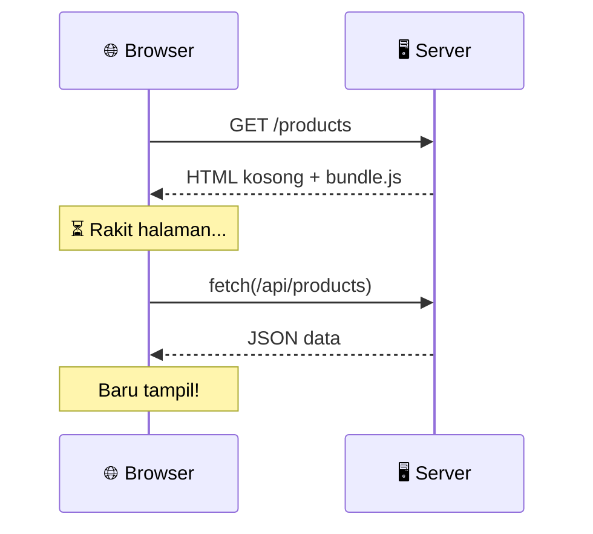
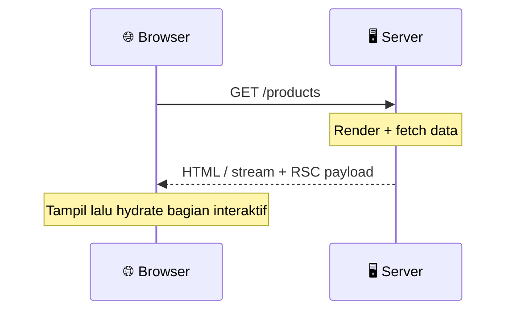
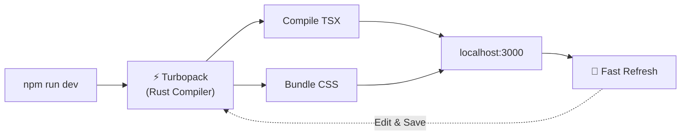

## 01. Pengenalan Next.js & Setup Project

Memahami Fondasi Next.js, Perbedaan Arsitektur dengan React Biasa, serta Setup Project dengan Tooling Modern.

<!--
Modul ini adalah fondasi. Pastikan peserta memahami KENAPA Next.js, bukan hanya BAGAIMANA setup-nya.
Tekankan bahwa Next.js bukan sekadar "React + Router" tapi framework fullstack.
Durasi target: 45-60 menit.
-->

---
class: module-content
---

### Kenapa Next.js?

Framework React untuk routing, rendering server, dan integrasi backend dalam satu proyek.
Next.js bukan sekadar React dengan router bawaan. **Next.js adalah framework fullstack** yang memperluas kemampuan React ke server, menghadirkan performa tinggi dan developer experience kelas atas.

<div class="grid grid-cols-3 gap-4 mt-6">
  <BrutalCard v-click="1" class="forward:delay-0">
    <div class="font-black text-base mb-1">🌐 Fullstack & Server-First</div>
    <p class="text-xs text-gray-700">Ambil data langsung dari database di dalam komponen (RSC) tanpa repot membuat REST API terpisah dan <strong>tanpa mengirim implementasi Server Component ke browser</strong>.</p>
  </BrutalCard>
  <BrutalCard v-click="2" class="forward:delay-200">
    <div class="font-black text-base mb-1">⚡ Hybrid Rendering & Streaming</div>
    <p class="text-xs text-gray-700">Gabungkan kecepatan HTML statis (CDN), SSR dinamis, dan <strong>Streaming Suspense</strong>. Bagian yang siap dapat tampil lebih dulu; latensi jaringan tetap ada.</p>
  </BrutalCard>
  <BrutalCard v-click="3" class="forward:delay-400">
    <div class="font-black text-base mb-1">🛡️ Batas Server & Browser</div>
    <p class="text-xs text-gray-700">Secret dapat disimpan di server. Keamanan, metadata, dan performa tetap perlu dirancang serta diuji.</p>
  </BrutalCard>
</div>

<!--
Klik 3x untuk memunculkan card satu per satu.
Card 1: Implementasi RSC tidak dikirim; framework runtime dan Client Components tetap memiliki JavaScript.
Card 2: Jelaskan Streaming Suspense secara singkat — user tidak perlu menunggu seluruh halaman selesai.
Card 3: Jelaskan bahwa pemilihan framework tidak menggantikan otorisasi atau pengukuran performa.
-->

---
class: module-content
layout: two-cols
---

### React SPA vs Next.js

Pilih arsitektur berdasarkan kebutuhan produk

::left::

#### React SPA dengan Vite

- Rendering utama berjalan di browser.
- Cocok untuk aplikasi internal dan interaksi intensif.
- Perlu memilih router dan backend sendiri.
- Secret tetap harus disimpan di backend.
- CRA sudah deprecated; gunakan tooling yang dipelihara.

::right::

#### Next.js App Router

- Mendukung prerender, rendering per request, dan streaming.
- Routing, metadata, serta Route Handlers tersedia.
- Cocok saat konten publik dan backend terintegrasi dibutuhkan.
- Performa bergantung pada cache, query, dan JavaScript.
- SSR bukan jaminan SEO atau keamanan otomatis.

<!--
Sumber: https://react.dev/blog/2025/02/14/sunsetting-create-react-app
SPA bukan sinonim seluruh React. Pages Router juga mendukung SSR/SSG.
-->

---
class: module-content
layout: two-cols
---

### Visualisasi Alur Request

Melihat Perbedaan Perjalanan Data dari Browser ke Server

::left::

#### React Biasa (SPA)



::right::

#### Next.js (App Router)



<!--
Diagram menyederhanakan initial document request. Aset, RSC payload, hydration, dan prefetch dapat menambah request; jangan menjanjikan jumlah round-trip tetap.
Ini dampaknya besar di koneksi lambat (3G, pedesaan).
Tanyakan ke peserta: "Kira-kira mana yang lebih cepat di HP dengan sinyal lemah?"
-->

---
class: module-content
---

### Ringkasan Perbedaan Utama

| Aspek          | React SPA dengan Vite              | Next.js App Router                    |
| :------------- | :--------------------------------- | :------------------------------------ |
| Rendering awal | Umumnya di browser                 | Prerender / server / streaming        |
| Routing        | Pilih library router               | File conventions di `app/`            |
| Backend        | Layanan terpisah                   | Route Handlers atau layanan terpisah  |
| JavaScript     | Optimalkan bundle & code splitting | Batasi client boundary & ukur bundle  |
| SEO            | Rencanakan rendering dan metadata  | Metadata API; tetap perlu konfigurasi |
| Operasional    | Static hosting + API               | Static export atau runtime server     |

<BrutalCard class="mt-4 text-sm">
  Ukur kebutuhan SEO, interaktivitas, biaya server, dan kemampuan tim sebelum memilih.
</BrutalCard>

---
class: module-content
---

### Inisialisasi Project Baru

Baseline kelas: Next.js 16.3, TypeScript, App Router, Tailwind CSS v4

```bash
node --version
npx create-next-app@16.3.6 my-next-app --ts --eslint --tailwind --src-dir --app --use-npm --import-alias "@/*"
cd my-next-app
npm run dev
```

- Gunakan Node.js LTS yang masih didukung; minimum framework **20.9**.
- Commit `package-lock.json`; CI memakai `npm ci` agar dependensi konsisten.
- **25 September 2026:** patch 16.3.6 sudah tersedia. Periksa advisory sebelum kelas/deploy.
- Prompt CLI dapat berubah. Flag eksplisit di atas menyatakan pilihan kelas.

<!--
Sumber: https://nextjs.org/docs/app/getting-started/installation
Patch tersedia: https://nextjs.org/blog/nextjs-security-update-september-22-2026
16.3.7 dijadwalkan 30 September, belum dianggap telah dirilis pada tanggal audit.
-->

---
class: module-content
layout: two-cols
leftCard: false
rightCard: false
---

### Anatomi Project Next.js

Mengenal Isi Folder yang Dihasilkan `create-next-app`

::left::

```txt {3-6|7|8-12|all}
my-next-app/
├── src/
│   └── app/
│       ├── layout.tsx
│       ├── page.tsx
│       └── globals.css
├── public/
├── next.config.ts
├── postcss.config.mjs
├── tsconfig.json
├── eslint.config.mjs
└── package.json
```

::right::

<div class="space-y-3">

<BrutalCard>
  <div class="font-black">📁 src/app/ — Jantung Aplikasi</div>
  <p class="text-gray-700 mt-1"><strong>layout.tsx</strong> = pembungkus semua halaman<br/><strong>page.tsx</strong> = halaman beranda (<code>/</code>)<br/><strong>globals.css</strong> = stylesheet global Tailwind</p>
</BrutalCard>

<BrutalCard v-click="1">
  <div class="font-black">📁 public/ — Aset Statis</div>
  <p class="text-gray-700 mt-1">Gambar, favicon, dan file statis lainnya yang bisa diakses langsung via URL tanpa proses build.</p>
</BrutalCard>

<BrutalCard v-click="2">
  <div class="font-black">⚙️ File Konfigurasi</div>
  <p class="text-gray-700 mt-1"><strong>next.config.ts</strong> = atur framework<br/><strong>globals.css</strong> = import Tailwind v4 & token via @theme<br/><strong>tsconfig.json</strong> = atur TypeScript</p>
</BrutalCard>

</div>

<!--
Klik 3x untuk menjelaskan tiap kelompok folder + highlight pada tree di kiri.
Klik 1: Fokus ke app/ — ini jantung aplikasi, tempat semua halaman dibuat. layout.tsx = "bingkai" yang membungkus semua halaman.
Klik 2: public/ — bedakan dengan assets yang di-import (processed oleh bundler vs langsung serve).
Klik 3: Config files — jelaskan bahwa kebanyakan sudah auto-generated, jarang perlu diubah manual.

Slide ini menjadi jembatan natural ke Modul 02 (App Router & Routing).
-->

---
class: module-content
---

### Tailwind CSS: Styling Cepat

Menulis CSS Langsung di Atribut `className` Tanpa Berpindah File

````md magic-move
```tsx
// Pilihan valid: CSS biasa atau CSS Modules untuk style terpisah
import "./button.css";

export default function Button() {
  return <button className="primary-blue-button">Register Now</button>;
}
```

```tsx
// ✅ Tailwind CSS: Utility classes directly on elements!
export default function Button() {
  return (
    <button className="bg-blue-600 hover:bg-blue-700 text-white font-bold py-2 px-4 rounded-lg shadow-md transition-all">
      Register Now
    </button>
  );
}
```
````

<div v-click class="mt-4 grid grid-cols-3 gap-3 text-xs">
  <BrutalCard class="text-center forward:delay-0">
    <code>bg-blue-600</code><br/>Warna latar tombol
  </BrutalCard>
  <BrutalCard class="text-center forward:delay-200">
    <code>hover:bg-blue-700</code><br/>Efek saat kursor diarahkan
  </BrutalCard>
  <BrutalCard class="text-center forward:delay-400">
    <code>py-2 px-4</code><br/>Jarak padding vertikal & horizontal
  </BrutalCard>
</div>

<!--
Magic move menganimasikan transisi dari pendekatan CSS terpisah ke Tailwind CSS.
Tunjukkan bahwa:
1. Tidak perlu file CSS terpisah (import "./button.css" hilang)
2. Tidak perlu memikirkan nama class kustom (.primary-blue-button)
3. Utility classes langsung deskriptif (bg-blue-600, hover:bg-blue-700, py-2 px-4)
-->

---
class: module-content
layout: two-cols
---

### Konfigurasi Linter & Formatter

Menjaga Kode Tetap Bersih, Rapi, dan Konsisten di Dalam Tim

::left::

#### ESLint (Flat Config & CLI)

Mendeteksi **kesalahan logika dan bug** sebelum dijalankan:

```js {1-2|3-4|6-8|10|all}
// eslint.config.mjs
import { defineConfig } from "eslint/config";
import nextVitals from "eslint-config-next/core-web-vitals";
import nextTs from "eslint-config-next/typescript";

export default defineConfig([...nextVitals, ...nextTs]);
```

Jalankan audit kode via CLI ESLint:

```bash
npx eslint .
```

::right::

#### Prettier (Auto-Formatting)

Merapikan **spasi, titik koma, dan urutan class**:

```bash
npm install -D prettier prettier-plugin-tailwindcss
```

Buat file `.prettierrc`:

```json {3|4|all}
{
  "semi": false,
  "singleQuote": true,
  "plugins": ["prettier-plugin-tailwindcss"]
}
```

<!--
ESLint — klik 5x untuk jelaskan bertahap:
1. Nama file — format flat config (.mjs), bukan .json lama
2. Import flat config native Next.js
3. Gunakan flat config native dari eslint-config-next; FlatCompat tidak diperlukan
4. Extends next/core-web-vitals — aturan bawaan dari tim Next.js
5. Semua terlihat

Prettier: semi false = tanpa titik koma, singleQuote = petik satu.
Plugin tailwindcss = auto-sort class Tailwind saat format.
-->

---
class: module-content
---

### Ekosistem Linter: ESLint, Oxlint & Biome

Bandingkan aturan yang diperlukan tim, bukan hanya benchmark sintetis

| Tool   | Kekuatan                                      | Hal yang perlu dicek                         |
| :----- | :-------------------------------------------- | :------------------------------------------- |
| ESLint | Plugin Next.js, React Hooks, TanStack Query   | Waktu lint pada repo sendiri                 |
| Oxlint | Linter berbasis Rust; Oxfmt untuk format      | Dukungan aturan/plugin yang dipakai          |
| Biome  | Format, lint, organize imports; plugin GritQL | Bukan pengganti langsung semua plugin ESLint |

- Kelas ini memakai **ESLint + Prettier** untuk konsistensi.
- `next build` tidak menjalankan lint: tambahkan `eslint .` sebagai tahap CI.
- Ukur kecepatan pada codebase dan konfigurasi yang sama.

<!--
Sumber: https://oxc.rs/ dan https://biomejs.dev/linter/plugins/
Jangan mengajarkan fmtlint sebagai formatter Oxc, atau angka percepatan universal.
-->

---
class: module-content
layout: two-cols
---

### Auto Sort & Remove Unused Imports

::left::

#### ESLint

```bash
npm i -D eslint-plugin-simple-import-sort eslint-plugin-unused-imports
```

Daftarkan plugin dan rules di flat config. Instalasi saja belum mengaktifkan aturan.

- `simple-import-sort/imports`: urutkan import.
- `unused-imports/no-unused-imports`: hapus import tak terpakai.
- Variabel tak terpakai perlu diperiksa; tidak semua aman dihapus otomatis.

::right::

#### Editor & Alternatif

- Jalankan `npx eslint . --fix` setelah rules aktif.
- Aktifkan code actions saat save jika memakai VS Code.
- Biome memiliki organize imports; Oxlint dapat dipasangkan dengan Oxfmt.
- Periksa diff: import side-effect dan urutannya dapat memengaruhi perilaku.

<!--
Demo berikut adalah ilustrasi hasil rule; bukan konfigurasi siap pakai.
-->

---
class: module-content
---

### Demo: Auto Sort & Remove Unused Imports

Ilustrasi transformasi import; rules plugin harus sudah dikonfigurasi

````md magic-move
```tsx
// Sebelum: hanya Link, useState, dan Heart yang digunakan
import { useState, useEffect } from "react";
import Image from "next/image";
import Link from "next/link";
import { Trash, Heart } from "lucide-react";
```

```tsx
// Sesudah: urutan mengikuti konfigurasi grup import tim
import { Heart } from "lucide-react";
import Link from "next/link";
import { useState } from "react";
```
````

- Jalankan `npx eslint . --fix`, lalu periksa diff.
- Save action editor hanya bekerja jika ekstensi dan rules sudah aktif.
- Jangan menghapus import side-effect yang diperlukan aplikasi.

---
class: module-content
---

### Menjalankan Development Server (Turbopack)

Melihat Hasil Proyek Pertama Antum Secara Langsung dengan Kompiler Rust

Jalankan perintah ini di terminal proyek:

```bash
npm run dev
```

<v-clicks>

1. 🌐 Buka browser dan kunjungi alamat `http://localhost:3000`
2. 🎉 Halaman pembuka Next.js siap menyambut Antum!
3. ⚡ Di **Next.js 16**, engine **Turbopack sudah aktif secara default** — kompilasi dan _Fast Refresh_ berjalan secepat kilat!

</v-clicks>



<BrutalCard v-click class="mt-2">
  <BrutalBadge color="cyan">TIGA SCRIPT UTAMA (TURBOPACK DEFAULT)</BrutalBadge>
  <div class="grid grid-cols-3 gap-2 mt-3 text-xs">
    <div><code>npm run dev</code> — Jalankan mode koding (development)</div>
    <div><code>npm run build</code> — Kompilasi untuk siap rilis (production)</div>
    <div><code>npm run start</code> — Uji jalankan hasil kompilasi produksi</div>
  </div>
</BrutalCard>

<!--
Jika memungkinkan, demo langsung di terminal.
Tunjukkan bahwa setelah edit file dan save, halaman di browser langsung berubah (Fast Refresh) tanpa reload manual.
Jelaskan: Turbopack adalah bundler default; Webpack masih dapat dipilih untuk kebutuhan kompatibilitas. Benchmark bergantung proyek.
Siklus Fast Refresh: edit → save → Turbopack compile ulang hanya file yang berubah → browser update otomatis.
-->

---
layout: intro
badge: "RANGKUMAN"
badgeColor: "yellow"
hideInToc: true
transition: slide-up
---

## 3 Hal Penting dari Modul 01

<v-clicks>

1. <span v-mark.box.yellow="1">**Next.js Menggabungkan Server & Browser**</span>: Menghadirkan performa cepat, ramah mesin pencari (SEO), dan hemat beban perangkat pengguna.
2. <span v-mark.box.cyan="2">**Setup Cepat & Turbopack Default**</span>: `create-next-app` langsung menghasilkan project modern dengan engine Turbopack Rust bawaan Next.js 16.
3. <span v-mark.box.pink="3">**Tooling Modern Meningkatkan Kecepatan Kerja**</span>: Kombinasi Prettier, ESLint Flat Config, dan Tailwind CSS memastikan kode Antum selalu rapi dan konsisten.

</v-clicks>

<BrutalCard v-click class="mt-8 bg-brutal-cyan/10">
  🚀 <strong>Selanjutnya di Modul 02:</strong> Kita akan mempelajari bagaimana <strong>App Router</strong> mengubah folder menjadi halaman secara otomatis — buat folder dan <code>page.tsx</code> di <code>app/</code> untuk mengekspos halaman!
</BrutalCard>

<!--
Rangkuman ini deliver dalam 1 menit.
v-mark box muncul bersamaan dengan teks (efek hand-drawn annotation).
Teaser Modul 02 membangun antisipasi untuk sesi berikutnya.
-->

<!--
Checkpoint: Setup yang Reproducible
Buat proyek dari CLI, jalankan dev dan build, lalu jelaskan perbedaan rendering server dan hydration. Simpan lockfile dan versi Node.
Sumber primer: https://nextjs.org/docs/app/getting-started/installation
Audit: 25 September 2026.
-->
